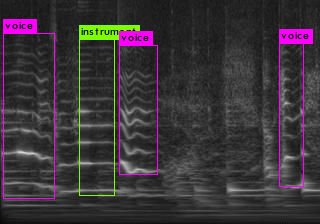
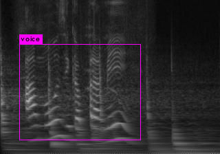
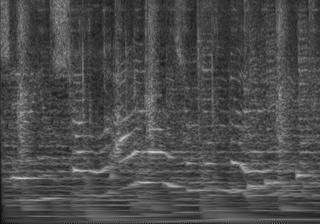
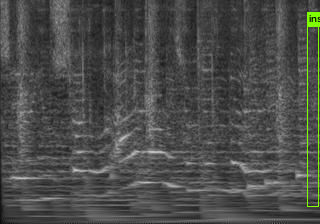
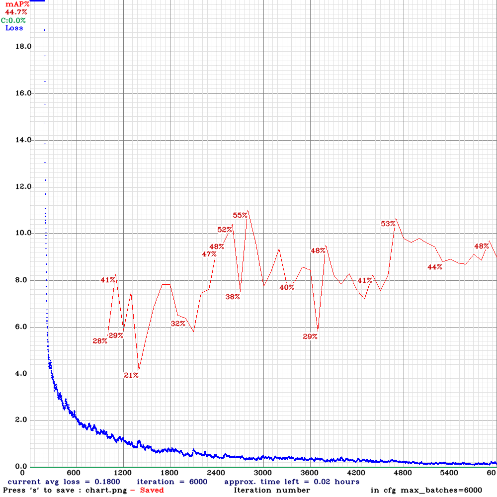

# YOLO spectrogram darknet clone   

This is a try of spectrogram detector by yolo cloned from AlexeyAB/darknet.git.   
Sound tagging (Audio tagging) commonly uses whole spectrogram. This aims to detect local area in spectrogram, which has any specific feature.   

## condition    

This time, number of train and test, is very small, 84 and 20.   
There are only two classes, voice and instrument, that means bent lines and flat lines,  
although they don't mean true voice and true instrument.   

## result  

train data  
  
  

valid(test) data  
  
  

## loss and mAP(mean Average Precision)    
mAP is still not good.  

   

## train and test  

Please refer to learn4-bat.sh and test4-bat.sh.   
And also refer to learn5-bat.sh to add number of train and test.   
  
  
Please refer making_spectrogram folder about making this dataset.  

