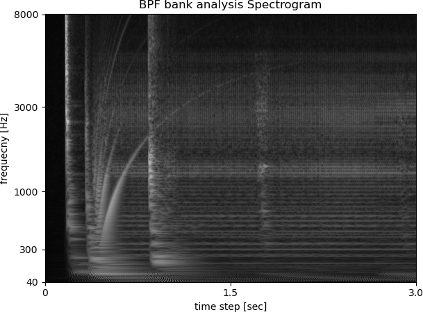

#  Making a spectrogram dataset for YOLO  

## Procedure  

- python spectrogram.py  Compute BPF bank analysis Spectrogram, although FFT spectrogram is commonly used.  
- [labelImg](https://https://github.com/tzutalin/labelImg/) Annotation spectrogram jpg manually.  In this, only 2 classes. Save label format is YOLO.  
- python resiez.py  Resize jpg size, multiple of 32 is required by YOLO.  

### BPF bank analysis Spectrogram sample  

  

In this sample, some continuous curves can be seen.   

